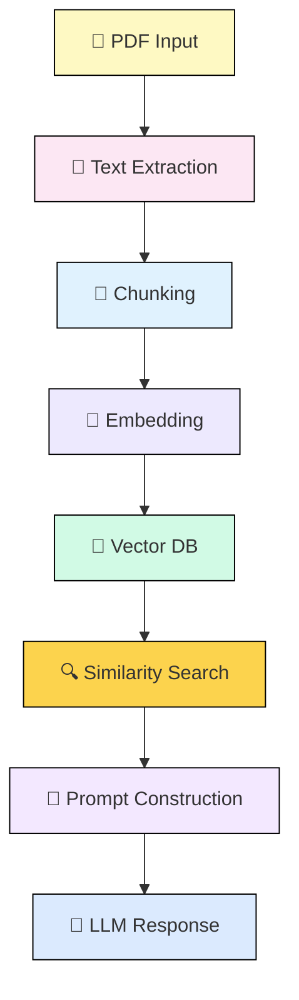

### 📊 **Mermaid Diagram for Your RAG Pipeline**

---

### 🧠 How It Works – Step by Step

| Step                       | Description                                                                                            |
| -------------------------- | ------------------------------------------------------------------------------------------------------ |
| **📄 PDF Input**           | The user uploads a `.pdf` file.                                                                        |
| **📝 Text Extraction**     | Text is extracted from the PDF using `PyPDF2`, or `ocrmypdf` if it's image-based.                      |
| **🔪 Chunking**            | The text is broken into overlapping segments using LangChain's `RecursiveCharacterTextSplitter`.       |
| **🔢 Embedding**           | Each chunk is embedded into a vector using SentenceTransformers.                                       |
| **🧠 Vector DB**           | All embeddings are stored temporarily (in memory or file-based).                                       |
| **🔍 Similarity Search**   | When a question is asked, its embedding is compared against the vector DB to retrieve relevant chunks. |
| **🧾 Prompt Construction** | The top-k chunks are inserted into a prompt with the user's question.                                  |
| **🤖 LLM Response**        | The prompt is sent to Ollama’s local LLM for generation.                                               |

---
