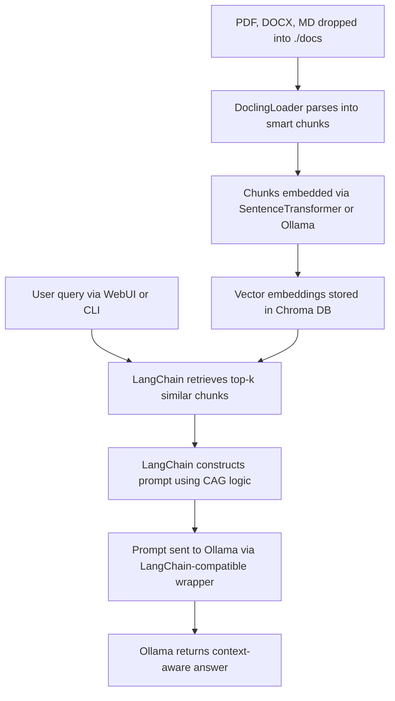

 Updated Mermaid Diagram: RAG-CAG Pipeline (test4_RAG_CAG_Docling)

⸻

RAG-CAG Pipeline Explained

Step	Description
1. Drop File	User drops files into ./docs folder (.pdf, .docx, .md, .jpg, etc.)
2. Parsing	DoclingLoader parses with layout awareness and format support
3. Embedding	Uses either local sentence-transformers or ollama_embed.py
4. Vector DB	Embeddings stored in Chroma for efficient similarity search
5. User Query	Query received via Open WebUI or CLI tool
6. Retrieval	LangChain fetches most similar k-chunks
7. Prompt Build	Combines query + relevant chunks using RAG_CAG template
8. LLM Response	Ollama model generates answer (e.g., llama3, phi3)
9. Return	Final response shown via CLI or WebUI

⸻

Evolution: test1 → test4 Breakdown

Version	Parsing	Embedding	Retrieval	Prompting	Output
test1	PyPDF2 + ocrmypdf	None (full doc sent)	None (manual)	Full text prompt	Slow
test2	Manual chunking + OCR	sentence-transformers	None	Top-N chunks injected manually	Faster
test3	Same as test2	sentence-transformers	Basic vector search (numpy)	Manual prompt string	Partial RAG
test4	DoclingLoader	Chroma + LangChain wrapper	Top-k via LangChain retriever	LangChain RAG_CAG Chain	Context-aware + fast

⸻

Next Goals
	1.	Docling adopted — layout-preserving, multi-format parsing (already integrated)
	2.	Adopt CAG (Cache-Augmented Generation):
	•	Cache frequent questions/chunks
	•	Use hybrid similarity metrics
	•	Explore LRU cache or Redis integration