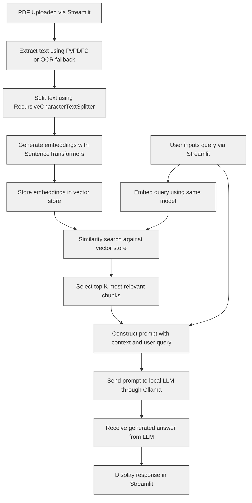

### 📈 Mermaid Diagram: Detailed RAG Pipeline

---

### 🧠 Summary of Key Steps

| Step | Description                                                                         |
| ---- | ----------------------------------------------------------------------------------- |
| A    | User uploads a `.pdf` through Streamlit.                                            |
| B    | Text is extracted using `PyPDF2`; if blank, fallback to `ocrmypdf`.                 |
| C    | Text is chunked using LangChain’s recursive splitter.                               |
| D    | Each chunk is converted into vector embeddings.                                     |
| E    | Embeddings are temporarily stored in memory (can be replaced with Chroma or FAISS). |
| F    | User submits a natural language question.                                           |
| G    | Question is also embedded.                                                          |
| H    | Embedding is compared against the vector DB to find similar chunks.                 |
| I    | Top-k most relevant text chunks are selected.                                       |
| J    | A prompt is constructed from those chunks + the question.                           |
| K    | The prompt is sent to a local model (e.g., `llama3`) running via Ollama.            |
| L    | Ollama generates the answer.                                                        |
| M    | Answer is shown to the user in Streamlit.                                           |
