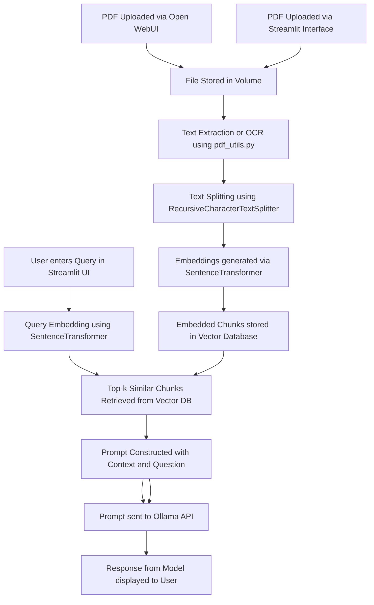

### 📈 Mermaid Diagram: Detailed RAG Pipeline




---

### ✅ **Step-by-Step Summary of the RAG Pipeline**

1. **📄 PDF Upload**

   * PDF is uploaded via either **Streamlit** or **Open WebUI** interface.

2. **🧠 Text Extraction / OCR**

   * For text-based PDFs, `pdf_utils.py` extracts text using `PyPDF2`.
   * For image-based PDFs, optional OCR is performed using `ocrmypdf`.

3. **✂️ Chunking**

   * Extracted text is split into overlapping chunks using `RecursiveCharacterTextSplitter`.

4. **🔍 Embedding and Similarity Search**

   * Chunks are embedded with `SentenceTransformer` (`all-MiniLM-L6-v2`).
   * The input query is also embedded.
   * Cosine similarity is computed between the query and all chunk embeddings.
   * Top `k` most similar chunks are selected.

5. **📦 Prompt Construction**

   * A prompt is dynamically constructed:

     ```text
     Context:
     [Top-k relevant chunks]

     Question: [User Query]
     Answer:
     ```

6. **🤖 LLM Query (Ollama)**

   * The prompt is sent to the Ollama backend (e.g., `llama3` model) at `http://ollama:11434/api/generate`.
   * A context-aware answer is returned.

---

