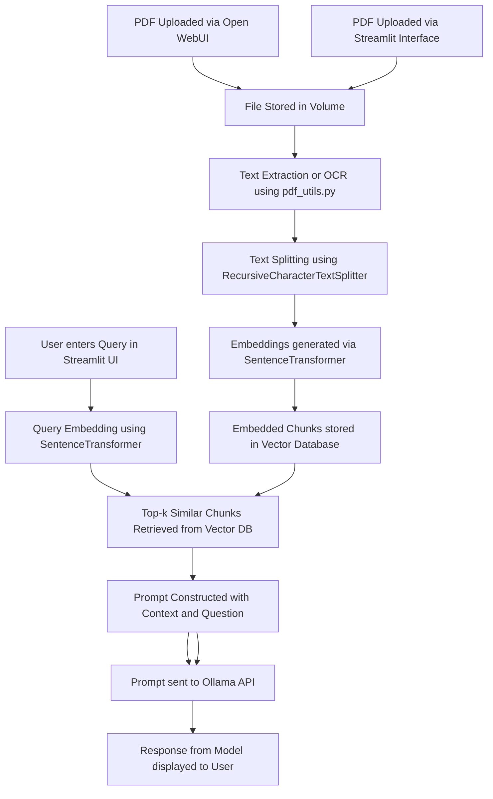

### 📈 Mermaid Diagram: Detailed RAG Pipeline

---
Here's a simplified summary:

**RAG Pipeline**

1. **Upload PDF**
	* Upload a PDF to the system.
2. **Text Extraction / OCR**
	* Extract text from the PDF if it's text-based, or use OCR (if implemented) for image-based PDFs.
3. **Chunking**
	* Split the text into smaller overlapping pieces.
4. **Embedding + Similarity Search**
	* Embed chunks and compare them to a query vector to find the top `k` most similar chunks.
5. **Prompt Construction**
	* Create a new prompt using the top `k` relevant chunks and the original query.
6. **LLM Query (Ollama)**
	* Send the prompt to Ollama's model (e.g., `llama3`) and get a context-aware answer.
