# RattGoLLAMA

`rattgollama` is a small RAG (Retrieval Augmented Generation) system for up to ~20 users. JWT-secured API and Streamlit UI. Ingestion Worker uses Docling + Ollama embeddings + Qdrant. MinIO for files, Postgres for metadata. Optional Open WebUI for general chat.

## 🚀 Quick Start

```bash
git clone <this-repo>
cd rattgollama
cp .env.example .env
docker compose up -d --build
```

Then visit `http://localhost:8080/`

**Default login:** `admin` / `admin`

## 👥 User Management

### **🔐 Streamlit Users (RAG Interface)**

#### **Method 1: Command Line Script**
```bash
# Add user
./scripts/add-user.sh add john secret123 user

# Add admin user  
./scripts/add-user.sh add alice admin456 admin

# List all users
./scripts/add-user.sh list

# Delete user
./scripts/add-user.sh delete john
```

#### **Method 2: API Endpoints (Admin only)**
```bash
# Get admin token
ADMIN_TOKEN=$(curl -s -X POST http://localhost:8002/auth/login \
  -H "Content-Type: application/json" \
  -d '{"username":"admin","password":"admin"}' | jq -r .access_token)

# Create user
curl -X POST http://localhost:8002/admin/users \
  -H "Authorization: Bearer $ADMIN_TOKEN" \
  -H "Content-Type: application/json" \
  -d '{"username":"john","password":"secret123","roles":"user"}'

# List users
curl -X GET http://localhost:8002/admin/users \
  -H "Authorization: Bearer $ADMIN_TOKEN"
```

### **💬 Open WebUI Users**

#### **Initial Setup (First Time)**
1. Visit `http://localhost:3001`
2. Sign up with first admin account, or use script:
```bash
./scripts/manage-openwebui-users.sh init-admin "Admin User" admin@company.com admin123
```

#### **Add Users via Script**
```bash
# Add regular user
./scripts/manage-openwebui-users.sh add admin@company.com admin123 "John Doe" john@company.com userpass123

# List users  
./scripts/manage-openwebui-users.sh list admin@company.com admin123

# Delete user
./scripts/manage-openwebui-users.sh delete admin@company.com admin123 user-uuid-here
```

#### **Add Users via Web Interface**
1. Login as admin at `http://localhost:3001`
2. Go to Admin Settings → Users
3. Click "Add User"
4. Fill in details and assign role

### **🤖 Download Additional Models**

The system comes with essential models (Llama 3.2, Mistral, CodeLlama, Phi3). To download more:

```bash
# Interactive model downloader
./scripts/download-models.sh

# Or manually download specific models
docker compose exec ollama ollama pull llama3.1:8b
docker compose exec ollama ollama pull qwen2.5:7b
```

## 🏗️ System Architecture

### **High-Level Architecture**

```mermaid
graph TB
    User[👤 User] --> Caddy[🌐 Caddy Reverse Proxy<br/>Port 8080]
    
    Caddy --> Streamlit[📱 Streamlit UI<br/>Document Upload & Search<br/>Port 8502]
    Caddy --> API[🔧 Ingestion API<br/>FastAPI + JWT Auth<br/>Port 8002]
    Caddy --> OpenWebUI[💬 Open WebUI<br/>Chat Interface<br/>Port 3001]
    
    API --> Postgres[(📊 PostgreSQL<br/>User accounts, metadata<br/>Document status)]
    API --> MinIO[(📁 MinIO<br/>Raw document storage<br/>S3-compatible<br/>Ports 9000-9001)]
    API --> Qdrant[(🔍 Qdrant<br/>Vector embeddings<br/>Semantic search<br/>Port 6333)]
    
    Worker[⚙️ Background Worker<br/>Document processing<br/>Embedding generation] --> Postgres
    Worker --> MinIO
    Worker --> Qdrant
    Worker --> Ollama[🦙 Ollama<br/>LLM Runtime<br/>nomic-embed-text<br/>llama3.2, mistral, etc.<br/>Port 11435]
    
    OpenWebUI --> Ollama
    
    subgraph "Storage Layer"
        Postgres
        MinIO
        Qdrant
    end
    
    subgraph "AI/ML Layer"
        Ollama
        Worker
    end
    
    subgraph "User Interface Layer"
        Streamlit
        OpenWebUI
        API
    end
```



### **Document Processing Flow**


### **Chat Flow (Open WebUI)**


### **Data Flow Architecture**

```mermaid
flowchart LR
    subgraph "Input Sources"
        PDF[📄 PDF Files]
        DOCX[📝 DOCX Files]
        TXT[📋 TXT Files]
        XLSX[📊 Excel Files]
    end
    
    subgraph "Processing Pipeline"
        Upload[📤 File Upload]
        Extract[🔍 Text Extraction]
        Chunk[✂️ Text Chunking]
        Embed[🧠 Embedding Generation]
    end
    
    subgraph "Storage Systems"
        RawFiles[(📁 MinIO<br/>Raw Files)]
        Metadata[(📊 PostgreSQL<br/>Metadata)]
        Vectors[(🔍 Qdrant<br/>Vector DB)]
    end
    
    subgraph "AI/ML Services"
        EmbedModel[🎯 nomic-embed-text<br/>768-dim vectors]
        ChatModels[💬 LLM Models<br/>llama3.2, mistral<br/>codellama, phi3]
    end
    
    subgraph "User Interfaces"
        RAGInterface[🔍 RAG Search<br/>Streamlit]
        ChatInterface[💭 Chat Interface<br/>Open WebUI]
    end
    
    PDF --> Upload
    DOCX --> Upload
    TXT --> Upload
    XLSX --> Upload
    
    Upload --> RawFiles
    Upload --> Metadata
    
    RawFiles --> Extract
    Extract --> Chunk
    Chunk --> Embed
    
    Embed --> EmbedModel
    EmbedModel --> Vectors
    
    Vectors --> RAGInterface
    ChatModels --> ChatInterface
    
    RAGInterface --> |Search Results| User[👤 User]
    ChatInterface --> |AI Responses| User
```



## 📋 Components

### Core Services

- **Ingestion API** (FastAPI): JWT authentication, file upload, document management
- **Background Worker**: Document processing, text extraction, embedding generation
- **Streamlit UI**: Main user interface for uploads, search, and document management
- **Caddy**: Reverse proxy with automatic HTTPS

### Storage

- **PostgreSQL**: User accounts, document metadata, embedding references
- **Qdrant**: Vector database for semantic search
- **MinIO**: S3-compatible object storage for raw files

### AI/ML

- **Ollama**: Local LLM runtime with `nomic-embed-text` model (768 dimensions)

### Optional

- **Open WebUI**: Community chat interface (manages its own documents separately)

## 🔒 Authentication

JWT-based authentication system:
- Login via Streamlit or API endpoint
- JWT includes user ID and roles
- All API calls require `Authorization: Bearer <token>` header
- Session management in Streamlit

## 📁 File Processing Pipeline

1. **Upload**: User uploads file via Streamlit → stored in MinIO
2. **Queue**: Document marked as "pending" in PostgreSQL
3. **Process**: Background worker picks up pending documents
4. **Extract**: Text extracted using format-specific parsers (PDF, DOCX, etc.)
5. **Chunk**: Text split into overlapping chunks
6. **Embed**: Each chunk processed through Ollama's `nomic-embed-text`
7. **Store**: Vectors stored in Qdrant, references in PostgreSQL
8. **Complete**: Document status updated to "completed"

## ⚙️ Configuration

### Environment Variables (`.env`)

```bash
# Database
POSTGRES_USER=rattg_user
POSTGRES_PASSWORD=changeme
POSTGRES_DB=rattgllm

# Authentication
JWT_SECRET=supersecretkey

# Object Storage
MINIO_ROOT_USER=minioadmin
MINIO_ROOT_PASSWORD=minioadmin
```

### Hardware Requirements

**Minimum:**
- GPU: 12GB VRAM
- RAM: 32GB
- CPU: 8 cores
- Storage: 1TB NVMe

**Recommended:**
- GPU: 32GB VRAM
- RAM: 64GB
- CPU: 12-16 cores
- Storage: 2-4TB NVMe

## 🐳 Docker Services

| Service | Port | Purpose |
|---------|------|---------|
| `caddy` | 80, 443, 8080 | Reverse proxy |
| `streamlit` | 8501 | Main UI |
| `ingestion-api` | 8000 | REST API |
| `openwebui` | 3000 | Chat interface |
| `postgres` | 5432 | Database |
| `qdrant` | 6333 | Vector DB |
| `minio` | 9000, 9001 | Object storage |
| `ollama` | 11434 | LLM runtime |

## 📖 API Endpoints

### Authentication
- `POST /auth/login` - User login (returns JWT)

### Documents
- `POST /upload` - Upload file (requires auth)
- `GET /documents` - List user documents (requires auth)
- `POST /ingest/reindex` - Trigger document reprocessing (requires auth)

### Search
- `POST /search` - Semantic search (requires auth)

### Health
- `GET /health` - API health check

## 🔧 Development

### Local Development

```bash
# Start only infrastructure services
docker compose up -d postgres qdrant minio ollama

# Run services locally for development
cd services/ingestion-api && uvicorn app.main:app --reload
cd apps/streamlit && streamlit run app/main.py
```

### Adding New File Types

Extend `services/worker/worker.py`:
1. Add new format in `extract_text()` method
2. Install required parser in `requirements.txt`
3. Rebuild worker container

## ⚠️ Important Notes

### Open WebUI Caveat
Open WebUI manages its own document collection separate from the RattGoLLAMA ingestion pipeline. Documents uploaded through Streamlit won't automatically appear in Open WebUI chats.

### Authentication in Production
- Change default JWT secret
- Consider API keys or long-lived tokens for worker authentication
- Use strong passwords for database and MinIO

### GPU Support
Worker and Ollama containers require GPU access. Ensure:
- NVIDIA Docker runtime installed
- GPU drivers compatible with containers
- Sufficient VRAM for embedding model

## 📚 Supported File Formats

- **PDF** (.pdf)
- **Microsoft Word** (.docx, .doc)
- **Plain Text** (.txt)
- **Excel** (.xlsx, .xls)

## 🛠️ Troubleshooting

### Container Issues
```bash
# Check container logs
docker compose logs [service-name]

# Restart specific service
docker compose restart [service-name]
```

### GPU Problems
```bash
# Verify GPU access
docker run --rm --gpus all nvidia/cuda:11.0-base-ubuntu20.04 nvidia-smi
```

### Database Issues
```bash
# Connect to PostgreSQL
docker compose exec postgres psql -U rattg_user -d rattgllm
```

### Storage Issues
```bash
# MinIO console
open http://localhost:9001
```

## 🤝 Contributing

1. Fork the repository
2. Create feature branch
3. Test with `docker compose up --build`
4. Submit pull request

## 📄 License

MIT License - see LICENSE file for details