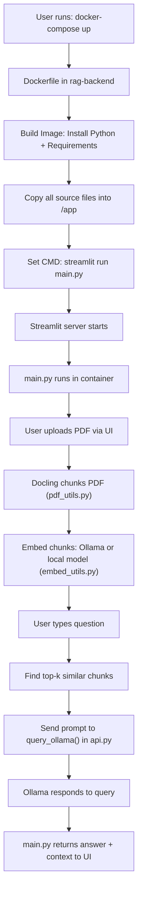

✅ Final README.md

# 🧠 Local RAG Chatbot with Ollama, Docling, and Streamlit

This project is a fully local Retrieval-Augmented Generation (RAG) system using:
- `Ollama` for running LLMs
- `Docling` for smart PDF/Doc chunking
- `sentence-transformers` or `Chroma` for retrieval
- `Streamlit` for the front-end UI
- `Open WebUI` for optional document management

---

## 📁 Project Structure
Here’s a step-by-step Mermaid diagram to show how your Python scripts work inside Docker, from build time to runtime, based on your project structure.

⸻

Mermaid: Docker Build & Execution Flow




⸻

Breakdown by Script

Script	Role
main.py	Entry point launched by Streamlit; handles UI and logic orchestration
pdf_utils.py	Converts PDF to chunks using Docling and optionally stores in Chroma
embed_utils.py	Embeds text chunks via SentenceTransformer (or Ollama)
api.py	Sends prompts to Ollama and optionally Open WebUI
config.py	Loads API URLs and tokens from .env
uploader.py	Optional CLI tool for batch uploading to WebUI
requirements.txt	Declares all dependencies for pip install
Dockerfile	Defines the image build (Python base, install, expose, CMD)
docker-compose.yml	Starts and connects all containers: Ollama, backend, WebUI


⸻

Would you like a second diagram showing LangChain mode vs pure local mode?
---

## 🧠 Install Ollama (macOS example)

```bash
brew install ollama
ollama serve

# Pull some models
ollama pull llama3
ollama pull codellama:7b           # for code generation
ollama pull mistral                # fast general-purpose
ollama pull phi3                   # small and performant

# Run a model manually
ollama run llama3
ollama list


⸻

🐳 Docker Commands

Start or Stop the App

sudo docker compose up --build -d
sudo docker compose down
sudo docker ps

Wipe Everything (Clean Reset)

sudo docker compose down --volumes --remove-orphans
sudo docker system prune -af --volumes


⸻

🌐 Interfaces

Component	URL
Streamlit App	http://localhost:8501
Open WebUI	http://localhost:3000
Ollama API	http://localhost:11434


⸻

✅ Notes
	•	.env files configure ports, model names, and tokens.
	•	main.py uses LangChain OR pure local embedding depending on mode.
	•	Ollama must be running and have models pulled before querying.
	•	Optional: You can connect Open WebUI to your own knowledge bases.

⸻

Happy hacking!

Let me know if you want a toggle flag in the app for `LangChain mode` vs `Local mode`, or a diagram (Mermaid or image) showing architecture.
